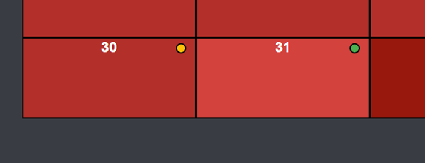
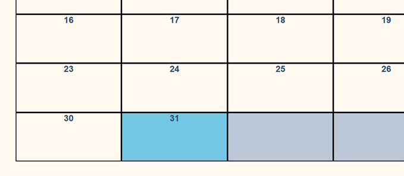
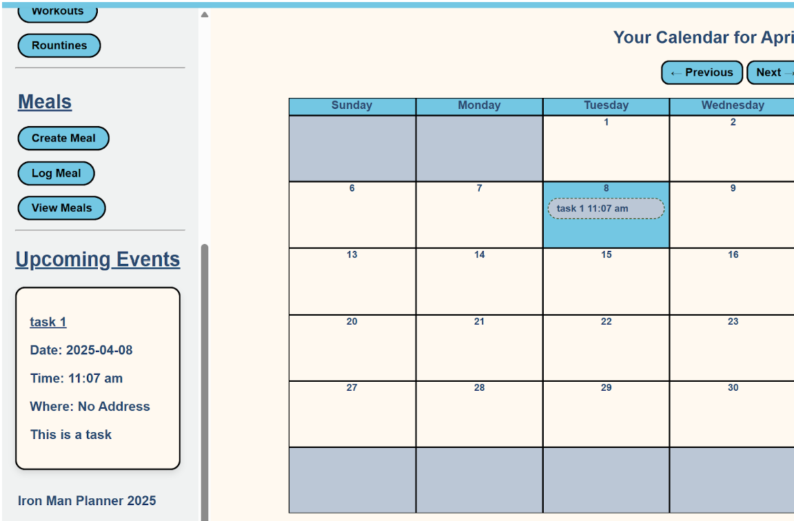
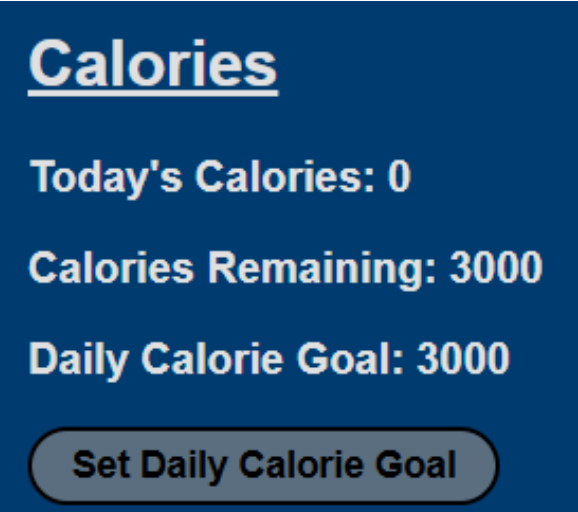
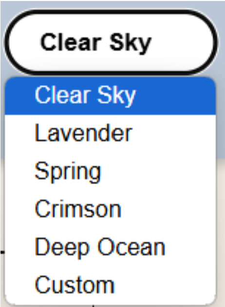
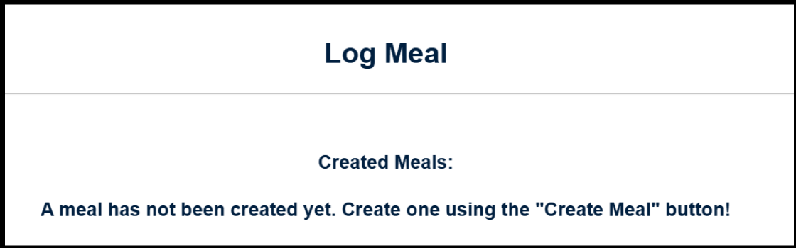
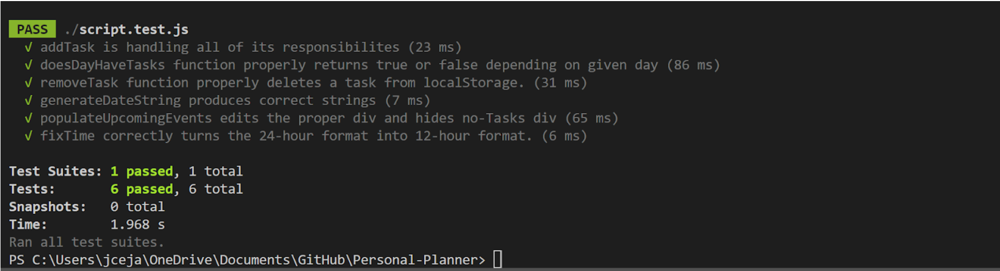

# Deliverable 6 \- Iron Man Planner

Cole Bishop, Dorian Sanchez, Daniel Fillerup, Travian Lenox, James Nguyen, Jesse Ceja

---

### Introduction

The Iron Man Planner is a fitness and nutrition tracker that allows groups such as athletes, trainers, and health conscious people to efficiently manage aspects of their fitness tasks by integrating all of these key elements into a single platform. Our planner can be broken down into 3 major feature categories including meal tracking, workout logging, and general event planning. As a part of the meal tracking, users can calculate their daily calorie goal on record meals and calories per day. For event planning, the Iron Man Planner has a calendar that allows the user to schedule events and plan tasks. For the final pillar, workout planning, users can create and manage both individual workouts and workout routines from the sidebar. To motivate users to keep up on their health journey we have a streak feature that tracks how long they have been consistent with using the planner. The themes feature has also been greatly expanded on to let users fully customize their Iron Man Planner. Finally, for data privacy we will give users complete control over their information by letting them clear cookies stored by the website anytime they like. 

[Live Iron Man Planner Link](https://personal-planner-kcjh2.ondigitalocean.app/)

[Iron Man Planner Github](https://github.com/Oracle451/Personal-Planner)

### Requirements

**Requirement:** As someone who values my own progress, I want to be able to mark the quality of my day and see it on my calendar so that I can observe my trends over time.  
**Issue:** [Enhance day rating · Issue \#86 · Oracle451/Personal-Planner](https://github.com/Oracle451/Personal-Planner/issues/86)  
**Pull request:** [Styling changes throughout page by DorianOklahoma · Pull Request \#92 · Oracle451/Personal-Planner](https://github.com/Oracle451/Personal-Planner/pull/92)  
**Implemented by**: Dorian Sanchez  
**Approved by**: Cole Bishop  
**Print screen:**

**Requirement:** As someone who is constantly on the move I want to be able to open my calendar and see what day it is to waste no time before getting started on work.  
**Issue:** [Highlight current day · Issue \#85 · Oracle451/Personal-Planner](https://github.com/Oracle451/Personal-Planner/issues/85)  
**Pull request:** [Calendar now highlights the current day by Oracle451 · Pull Request \#90 · Oracle451/Personal-Planner](https://github.com/Oracle451/Personal-Planner/pull/90)  
**Implemented by:** Cole Bishop  
**Approved by:** Dorian Sanchez  
**Print screen:**

**Requirement:** As someone who struggles with motivation I want to be able to rate the current day to earn a streak as a reward to keep me using the planner.  
**Issue:** [Day rating editing limitation · Issue \#88 · Oracle451/Personal-Planner](https://github.com/Oracle451/Personal-Planner/issues/88)  
**Pull request:** [Added Report 9 and Limited Day Ratings by Oracle451 · Pull Request \#89 · Oracle451/Personal-Planner](https://github.com/Oracle451/Personal-Planner/pull/89)  
**Implemented by**: Cole Bishop  
**Approved by:** Dorian Sanchez  
**Print screen:** 

**Requirement:** As someone who needs to prioritize tasks based on how soon they are, I want to see what upcoming events I have next.  
**Issue:** [Upcoming Events Functionality Issue \#46 Oracle451/Personal-Planner](https://github.com/Oracle451/Personal-Planner/issues/46)  
**Pull request:** [Upcoming Events Functionality Issue \#99 Oracle451/Personal-Planner](https://github.com/Oracle451/Personal-Planner/pull/99)  
**Implemented by:** Jesse Ceja  
**Approved by:** Cole Bishop  
**Print screen:** 

**Requirement:** As someone who needs to track their remaining calories, I want an easy way to see what I have left to eat in a day.  
**Issue:** [Allow users to track the amount of calories they have remaining. \#122](https://github.com/Oracle451/Personal-Planner/issues/122)  
**Pull request:** [Added functionality for users to view their remaining calories \#123](https://github.com/Oracle451/Personal-Planner/pull/123)  
**Implemented by:** Daniel Fillerup  
**Approved by:** Cole Bishop  
**Print screen:**   

**Requirement**: As someone who appreciates personalization I want to be able to select a color scheme that I like.  
**Issue**:   
**Pull request:** [condensed theme selector · Oracle451/Personal-Planner@3360bc4](https://github.com/Oracle451/Personal-Planner/commit/3360bc45b070507c45167af05dc413263c1c4176)  
**Implemented by:** Travian Lenox  
**Approved by:** Daniel  
**Print screen:** 

**Requirement**: As someone who likes to monitor their diet I want to be able to log my meals to specific days  
**Issue**: [Users cannot see their created meals when logging · Issue \#125 · Oracle451/Personal-Planner](https://github.com/Oracle451/Personal-Planner/issues/125)  
**Pull request:** [Improved meal functionality by jn867 · Pull Request \#108 · Oracle451/Personal-Planner](https://github.com/Oracle451/Personal-Planner/pull/108)  
**Implemented by:** James Nguyen  
**Approved by:** Travian Lenox  
**Print screen:**   

### Tests

Test Framework: Jest

Test 1: generateDateString(Date)  
Description: Based on given date, the function is expected to return a “date-string” which is part of the token generated on every single task that is generated and attached to it so we can save and load from localStorage, allowing for tasks to persist on closing and re-opening the website.

Test 2: populteUpcomingEvents()  
Description: The website is expected to be able to look up to a week in advance and show the user the next 5 tasks. Since this has no return type, this test monitors the creation of div’s with class name “.upcoming-Event”, effectively making sure the function is creating and adding elements to the html document.

Test 3: fixTime(timeString)  
Description: Based on the string given to the function by the html object \<select type=”time”\>, the function is expected to return a time in the 12-hour format, as the given type is in 24-hour format.

[Tests Location In Github](https://github.com/Oracle451/Personal-Planner/blob/main/script.test.js)

[Functions That Have Been Tested](https://github.com/Oracle451/Personal-Planner/blob/main/JavaScript/testedFunctions.js)

### Demo

[Iron Man Planner Demo Video](https://youtu.be/NsiZYiv9cRE) 

### Code Quality

To manage code quality our team decided to split our javascript file into multiple smaller files that each have related functions in them like “workouts.js” and we decided to have a consistent naming convention where we use clear descriptive names in camelcase. Finally we have opted to avoid global variables as much as possible, only saving them for the most important information that needs to be accessed everywhere.

- Variables Names: Clear and Descriptive names that use camelcase (Ex: onScreenDate)  
- Limit Global Variables: To keep things localized to functions, we want global variables to only be the most important data and used sparingly  
- JavaScript Separation: Instead of having one big javascript file, we want to have multiple smaller javascript files with more precise scope

### Lessons Learned

Being able to extend our functions with more features is an important part of building releases but many parts of our javascript are over bloated and do not support easy extension. For example, in the time between our last release and this release we realized that our setTheme function was using a case statement to set every single element of the webpage to have a unique color separately and this made it extremely time consuming and difficult to add new themes or modify colors. To fix this we split the function into 2 sub functions, set theme now uses a case statement to set 9 primary website colors into a “Colors” object and then it passes that object to an “applyTheme” function which handles applying the color palette to the website. This makes adding a new theme or setting custom colors much easier because we only need to set up a color object and pass it to the applyTheme function instead of making a whole new case in the switch case statement that manually changes all of the website elements. We also encountered a problem involving the look of the website on different browsers and screen sizes. It is easy to use static sizing and tweak the ratios until the website looks good on our personal laptop screen but this may not look as good on other screens. One change in particular resulted in submenu options going below the screen on some team members devices, to fix this we have decided to check with at least one other person to see how the changes look on their screen and use dynamic sizing going forward so the website adapts to different screens. Going forward we should aim for uniformity to solve both of these issues. By having more consistency in our ui design as well as our functions we can be much more efficient.

Problem 1: JavaScript functions that were built without extensibility and modularity in mind, making new features difficult to implement.

Solution: Refactor functions to be smaller sub functions that only handle specific tasks as well as using classes and parameters which functions adapt to for easy extendability.

Problem 2: Static UI Styling makes the website look different on different sized screens.

Solution: By using dynamic styling attributes and checking how our changes look on at least one other team member's device we can ensure that the website adapts to various screen sizes.

### Teamwork

* Cole Bishop (18%) \- Implemented the Description, Code Quality, and Lessons Learned Sections  
* Dorian Sanchez (15%) \- Created workout routine functionality in the website  
* Daniel Fillerup (15%) \- Added a calories remaining section to the sidebar  
* Travian Lenox (20%) \- Added Lavender theme and recorded demo video  
* Jesse (20%) \- Implemented tests for javascript functions  
* James (12%) \- Improved the log meals section of the sidebar