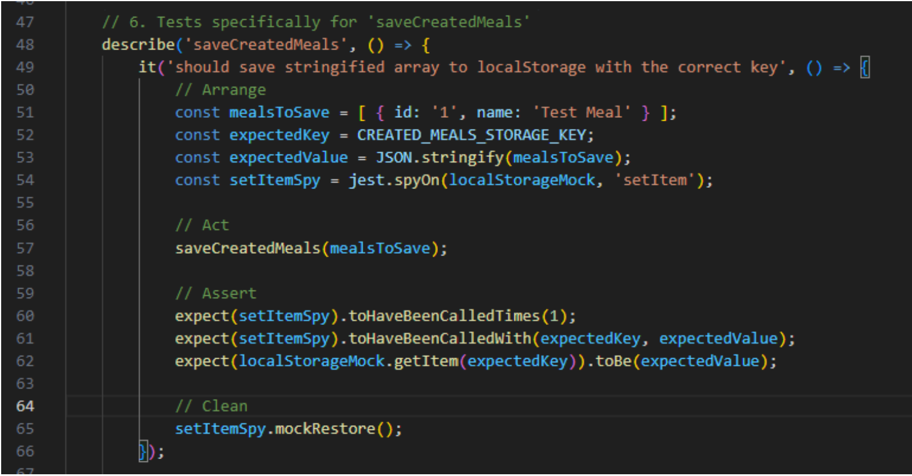
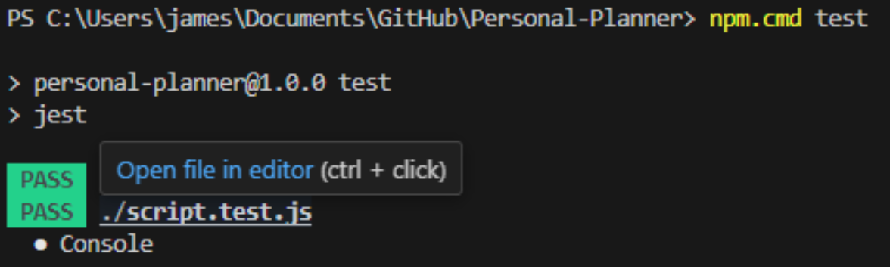
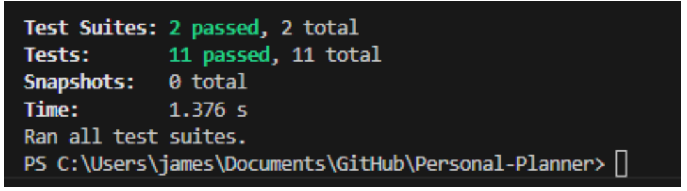
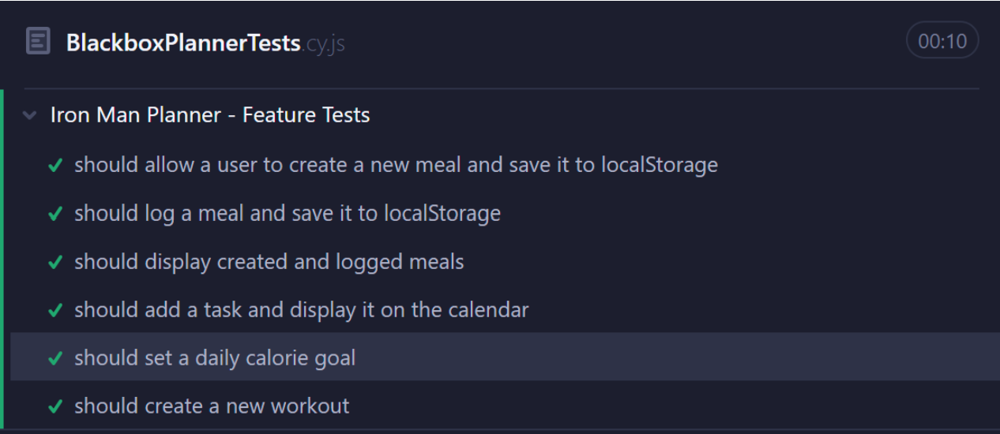

# Deliverable 7 \- Iron Man Planner

Cole Bishop, Dorian Sanchez, Daniel Fillerup, Travian Lenox, James Nguyen, Jesse Ceja

---

### Description

The Iron Man Planner is a fitness and nutrition tracker that allows groups such as athletes, trainers, and health conscious people to efficiently manage aspects of their fitness tasks by integrating all of these key elements into a single platform. Our planner can be broken down into 3 major feature categories including meal tracking, workout logging, and general event planning. As a part of the meal tracking, users can calculate their daily calorie goal on record meals and calories per day. For event planning, the Iron Man Planner has a calendar that allows the user to schedule events and plan tasks. For the final pillar, workout planning, users can create and manage both individual workouts and workout routines from the sidebar. To motivate users to keep up on their health journey we have a streak feature that tracks how long they have been consistent with using the planner. The themes feature has also been greatly expanded on to let users fully customize their Iron Man Planner. Finally, for data privacy we will give users complete control over their information by letting them clear cookies stored by the website anytime they like. 

[Live Iron Man Planner Link](https://personal-planner-kcjh2.ondigitalocean.app/)

[Iron Man Planner Github](https://github.com/Oracle451/Personal-Planner)

### Verification

Test Framework: Jest

Tests Folder: [https://github.com/Oracle451/Personal-Planner/tree/main/tests](https://github.com/Oracle451/Personal-Planner/tree/main/tests) 

Tested Class: [https://github.com/Oracle451/Personal-Planner/blob/main/tests/meals.test.js](https://github.com/Oracle451/Personal-Planner/blob/main/tests/meals.test.js) 

Test File: [https://github.com/Oracle451/Personal-Planner/blob/main/JavaScript/meals.js](https://github.com/Oracle451/Personal-Planner/blob/main/JavaScript/meals.js) 

Example Test Case:  

Print Screen Results:

### Acceptance Test

**Testing Framework**: [Cypress](https://www.cypress.io/)

[Acceptance Test Folder In Github](https://github.com/Oracle451/Personal-Planner/tree/main/cypress/e2e)

**Add Workout Acceptance Test:** This test will open the workouts popup by clicking the button on the sidebar, enter information for a new workout, create the new workout, and finally check to see if the new workout is in the workout library list with all the correct information.

[Link to Add Workout Acceptance Test](https://github.com/Oracle451/Personal-Planner/blob/main/cypress/e2e/BlackboxPlannerTests.cy.js)

**Print Screen Of Test Success**:

### Validation

**Questions:**

* What are your first impressions of the layout and design of our website?  
* Is it easy for you to digest as a potential user of the system?  
* What stands out to you as a person who wants to track their health?  
* Is there anything that you would want added to help you track your health?

**Tests:**

* Have the user test out the calorie tracking functionality.   
* Have the user test the streak system so they can keep track of their goals.  
* Have the user create a meal, and log it to show them how easy it is.

**Rating:**  

* Rating of the themes, and UI.  
* Rating of the functionality, and features.  
* Rating of the personal opinion of the overall website.

**User 1: Zak (Travian’s roommate)**

It's really simple so it's easy to understand. There are calorie goals and counting calories which is the most important for a health tracking app in my opinion. The most obvious thing that stands out to me is that I can see everything from one page which is nice because clicking through menus can be a pain. Honestly if I were to add anything it would be a way to easily access it on my phone, but as an app. Always needing to log on to a browser would be a pain at least for me.

I’d say the themes are pretty cool, but the fonts do look like a default browser so I would rate the themes a 7 out of 10\. The functionality is a lot better, and it really has everything that I think I would end up wanting and actually use so I would rate it a 9 out of 10\. And then overall I would say an 8\. It gets the features that you would probably want but still looks a little cheap and less modern.

**User 2: Angela (Travian’s mom)**		

It’s a lot to look at, but the size of the calendar is nice and makes it easier on the eyes. The buttons are clearly visible even with the different themes and it helps me know what features this website offers. What stands out is the calorie goal. It's nice that it has a link to a daily intake calculator so I can determine if I need to reduce my caloric intake or increase it. One thing I might want to add is a recipe saver so if I need meal prep ideas I can scroll through a list of recipes and make something based off what sounds good.

	The themes are nice, some of them are easier to look at than others, I give it a 7.5/10. The wide variety of features is a benefit to the planner, 8/10. Out of all the planners I’ve used this one is unique among them, It's a lot to look at at times so 7.8/10

**User 3: Jay (Daniel’s brother)**

	Yes and no because it has so much on the front page. It’s nice that you have so much to do but also probably overwhelming to me if I saw it. I do like tracking my calories, but it would be way harder for me to do on this website because I like to scan barcodes from food instead of manually typing in the numbers. But even without being able to do that I would still use it, just would be harder. I definitely would use the streak feature though because I am pretty inconsistent about tracking my calories.

	For the themes I would definitely say an 8 ish out of 10\. They look cool although some of them could definitely be taken away. I also like that mostly everything is findable even though it is a little crowded for sure. I’d say the functionality for me would be like a 6 just cause manually typing calorie values would get old, but other than that I would probably say a 8 or 9\. So overall I would give the website an 7.5 just because it isn’t the prettiest thing ever, and some of the tracking stuff is super tedious.

**Reflections:** 

	We noticed that of the three people we interviewed, they tended to not care for the overall look of the website and a couple of them found it to be overwhelming at first. We could work on increasing the size of objects to further simplify the initial look of the website to hopefully nullify some of these complaints. Users found the learning curve to be relatively easy, but did find some pain with actually tracking their meals. It is very tedious and time consuming to do so. The results were as expected from these tests, and we feel that by demonstrating the usability that we were working for, we as a team have adequately accomplished our initial value proposition.

### Teamwork

* Cole Bishop (16%) \- Implemented Description and Acceptance Tests  
* Dorian Sanchez (16%) \- Created Acceptance Tests  
* Daniel Fillerup (16%) \- Worked on Validation tests  
* Travian Lenox (16%) \- Implemented Validation test section  
* Jesse (16%) \- Created Verification Tests  
* James (16%) \- Verification Section